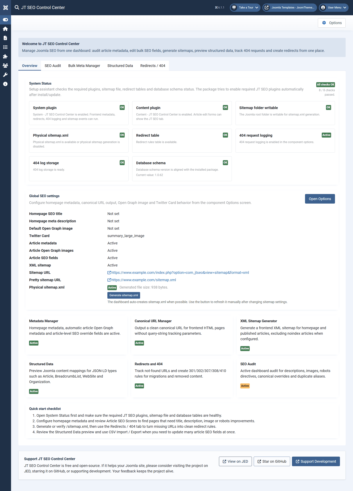
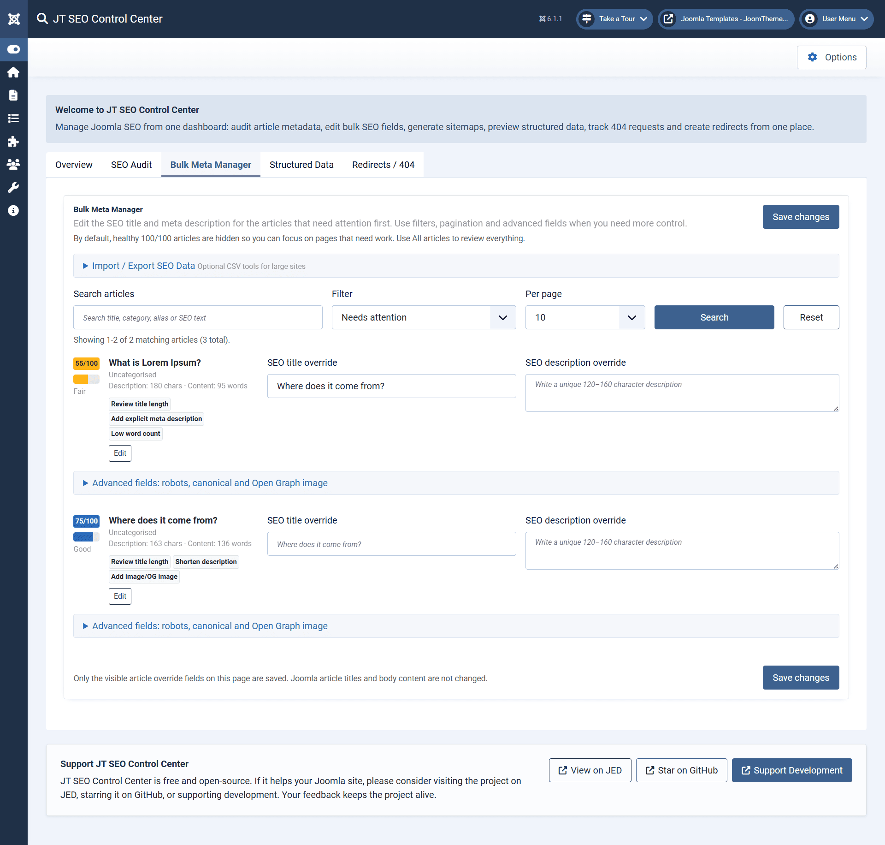
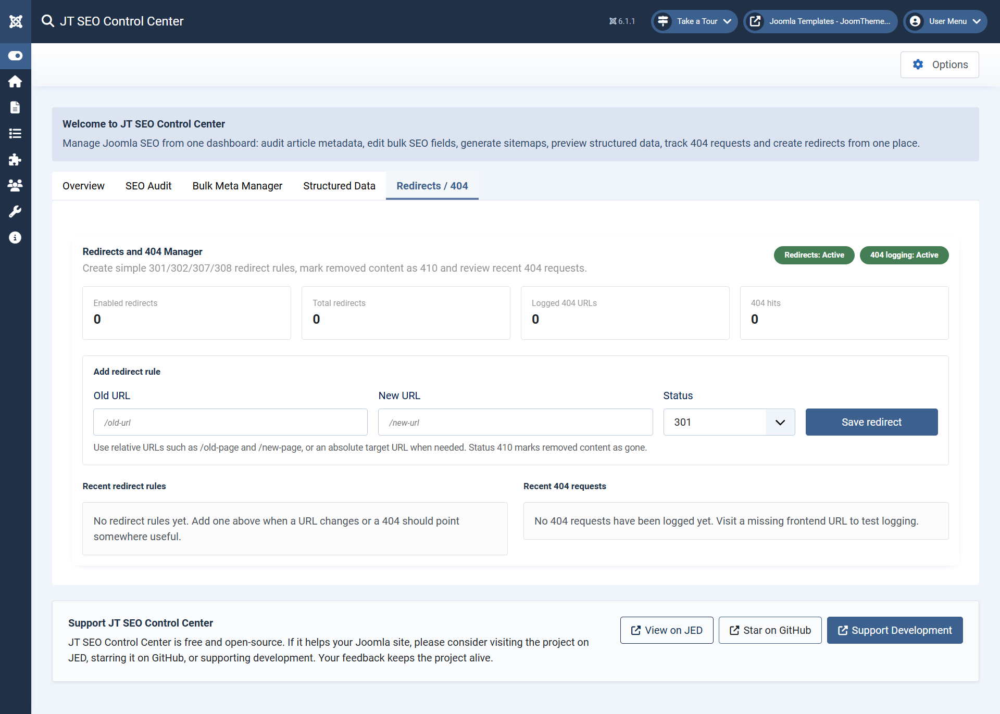
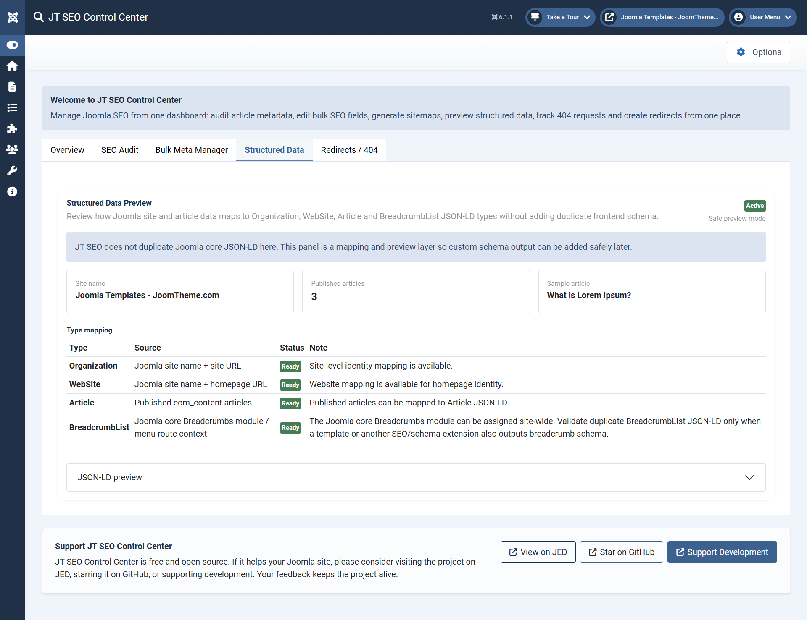
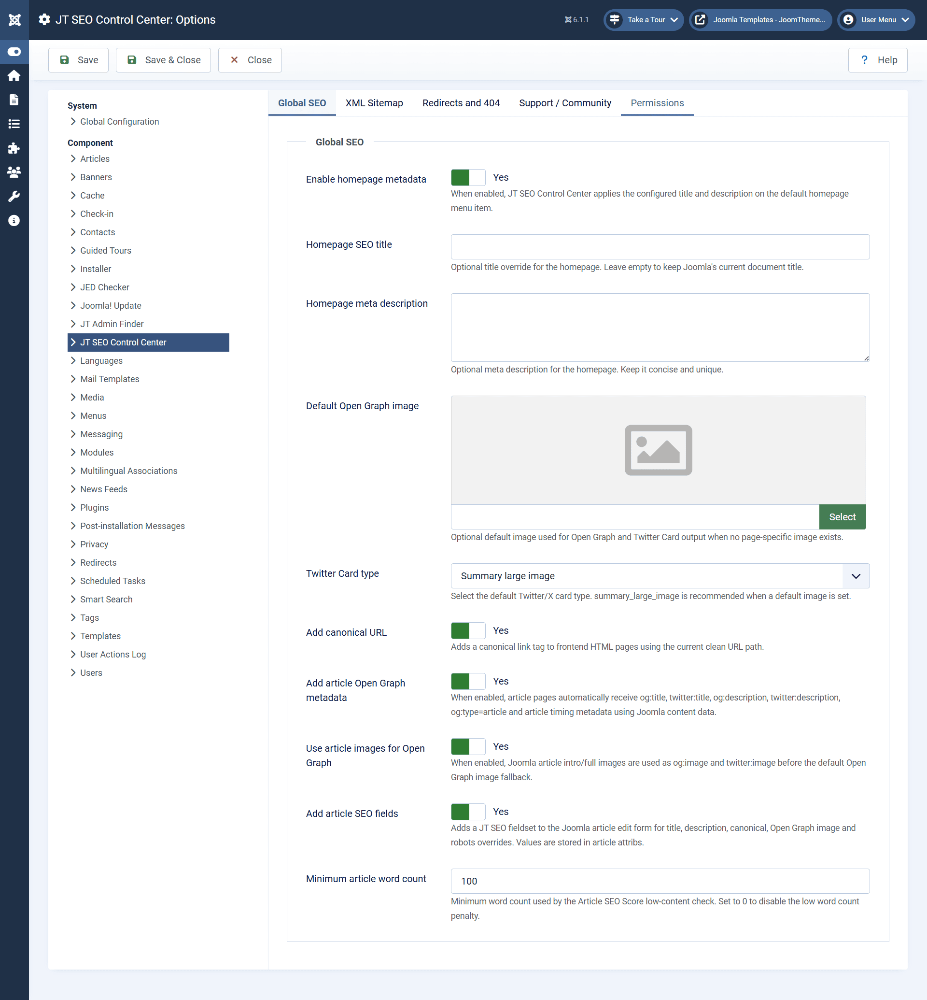

# JT SEO Control Center Demo

JT SEO Control Center is an administrator-only Joomla extension.
For security reasons, a public Joomla administrator login demo is not provided.

This page provides a visual walkthrough of the main administrator features.

## Dashboard

The dashboard provides an overview of SEO tools, redirects, 404 logging, structured data, sitemap tools and extension status.

## Bulk Meta Manager

The Bulk Meta Manager helps administrators review and edit article meta titles, meta descriptions and SEO scores from a single interface.

## Redirects / 404 Logs

The Redirects / 404 section allows administrators to manage URL redirects and review detected 404 requests.

## Structured Data

The Structured Data tools help configure JSON-LD output for supported Joomla content and site data.

## Component Options

The Component Options screen allows administrators to configure JT SEO Control Center settings, including redirects, 404 logging, sitemap behavior, structured data and other SEO-related options.

## Note

This extension does not provide a public frontend demo because its functionality is designed for the Joomla administrator area.
