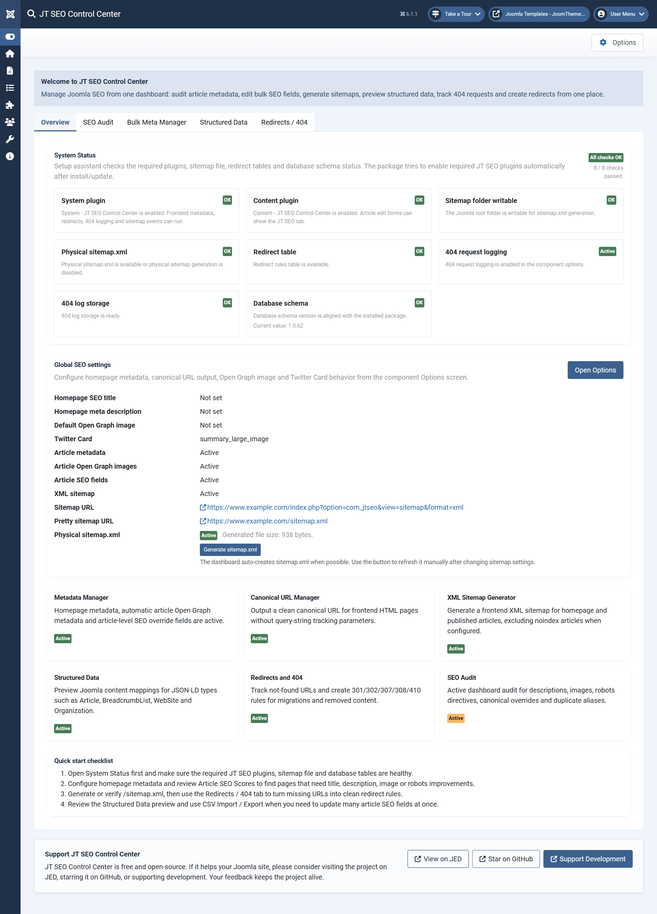
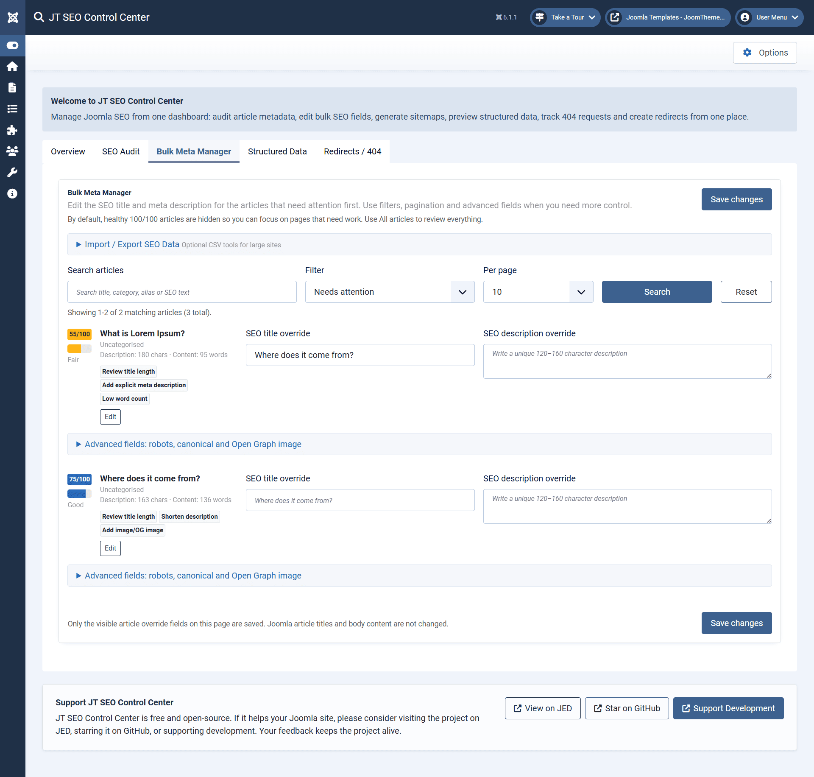
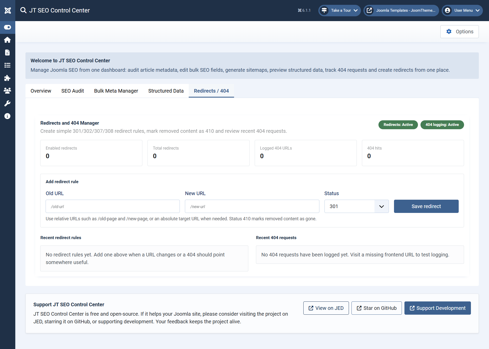
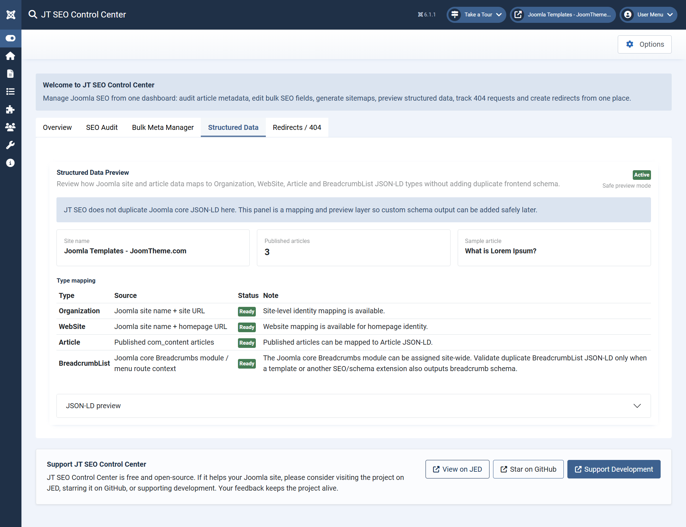
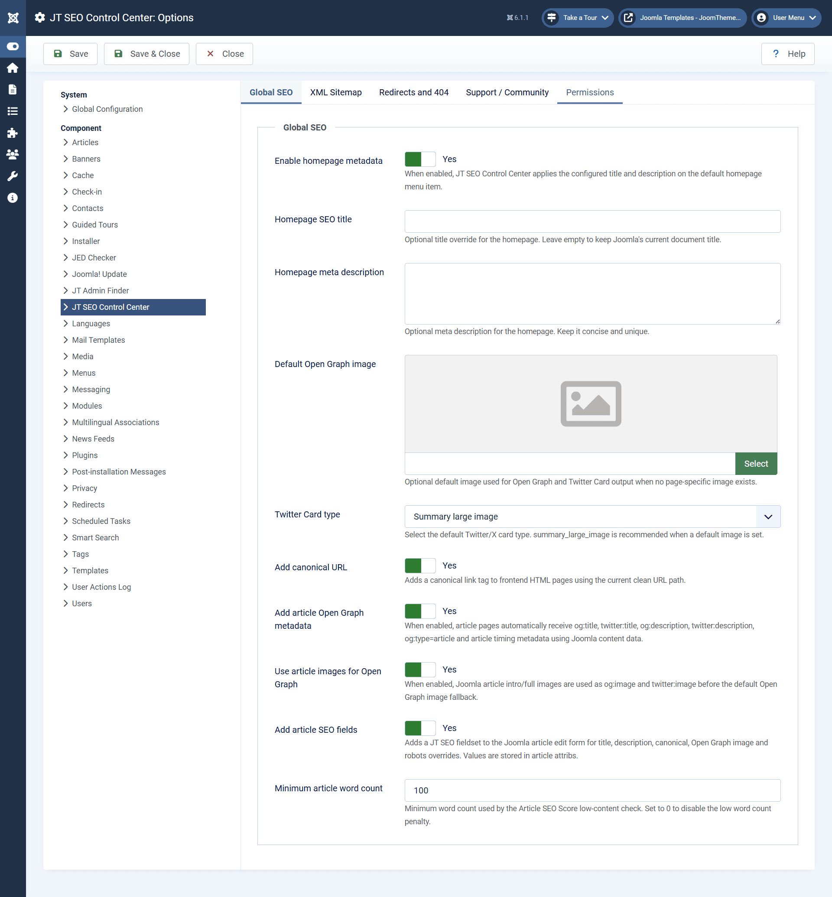

# JT SEO Control Center Demo

JT SEO Control Center is an administrator-focused Joomla extension.
For security reasons, a public Joomla administrator login demo is not provided.

This page provides a visual walkthrough of the main administrator features available in JT SEO Control Center 1.0.66.

## Dashboard

The dashboard provides a central overview of SEO tools, article health, XML sitemaps, redirects, 404 logging, Structured Data and extension status.

Administrators can quickly review the areas that need attention and access the main SEO workflows from one place.

## Bulk Meta Manager

The Bulk Meta Manager helps administrators review and edit SEO metadata for multiple Joomla articles from a single interface.

Supported workflows include:

- SEO title and description overrides
- SEO score review
- Search and filtering
- Pagination
- Canonical URL overrides
- Robots directives
- Open Graph image overrides
- CSV import and export

## Redirects / 404 Logs

The Redirects / 404 section allows administrators to manage URL redirects and review detected 404 requests.

Supported redirect status codes include 301, 302, 307, 308 and 410 Gone.

## Structured Data

JT SEO Control Center 1.0.66 adds frontend JSON-LD Structured Data generation for Joomla pages.

Supported Schema types include:

- Organization
- LocalBusiness
- WebSite
- WebPage
- Article
- ImageObject

The Structured Data system also supports:

- Dedicated homepage Schema configuration
- Multilingual Schema values based on Joomla language tags
- Language-specific organization name, description, logo, contact and address information
- Article `datePublished` and `dateModified`
- Page builder and non-article page `WebPage` Schema support
- Duplicate Schema detection to help avoid conflicting JSON-LD output

This component-independent approach allows pages created with SP Page Builder and other Joomla components to receive general WebPage structured data without requiring a dedicated integration for every page builder.

## Component Options

The Component Options screen allows administrators to configure JT SEO Control Center behavior from one place.

Available settings include:

- Homepage metadata
- Canonical URLs
- Open Graph and Twitter Card metadata
- XML sitemap generation
- Multilingual sitemap output
- Included and Excluded URL rules
- Structured Data and multilingual Schema settings
- Redirects
- 404 logging
- Support and community links

## Frontend Output

Although JT SEO Control Center is managed from the Joomla administrator area, several configured features affect the public frontend, including:

- Canonical metadata
- Open Graph and Twitter Card metadata
- JSON-LD Structured Data
- XML sitemaps
- Redirect handling
- 404 monitoring

For this reason, the extension does not provide a public administrator login demo. Screenshots are provided instead to demonstrate the management interface safely.

## Note

JT SEO Control Center is designed for Joomla 6 and provides administrator tools that generate and manage SEO-related frontend output without requiring direct template edits.
